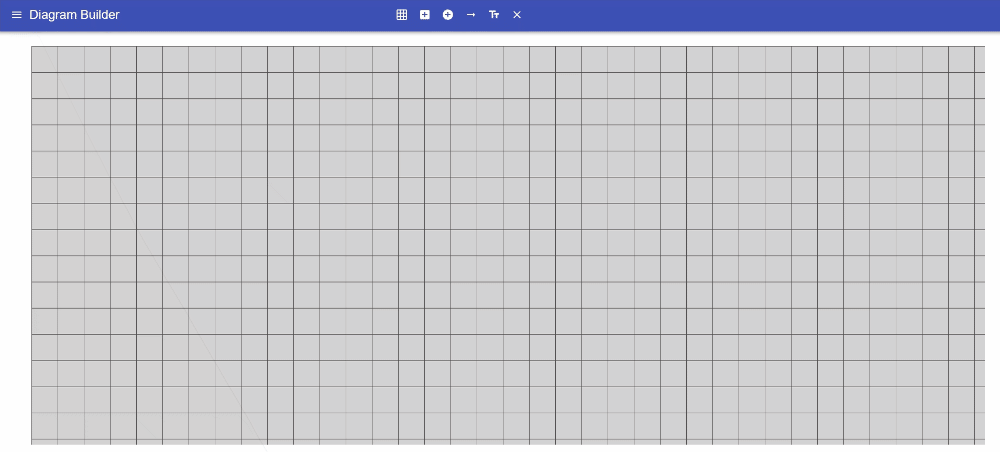
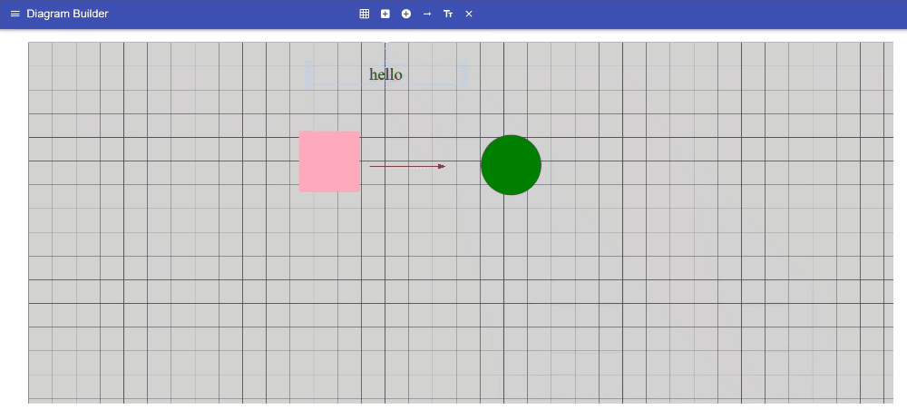

Packages Used:

Material-UI v4:
npm i @material-ui/core
npm install @material-ui/icons

FabricJS
npm install fabric --save

Demo of base functionality:
Adding:

Moving:

Editing:

Deleting / Toggle Grid

